<div align="center">

# M.E.R.I.D.I.A.N.


### Monetized Equitable Representational & Immutable Data Interface & Analytics Network

[](https://opensource.org/licenses/MIT)
[](https://developer.tbd.website/projects/web5/)
[](https://creditcoin.org/)
[]()

**Democratizing Data Ownership | Eliminating AI Bias | Empowering Communities**

[🎥 Watch Demo](#-demo-video) • [🚀 Quick Start](#-getting-started) • [📚 Documentation](#-how-it-works-architecture) • [🤝 Contributing](#-our-team)

---


</div>

---

## 🎯 The Problem We're Solving

<table>
<tr>
<td width="50%">

### 🤖 AI Bias Crisis
Modern AI models perpetuate inequality due to **narrow demographic data sources**, creating systems that:
- ❌ Underserve marginalized communities
- ❌ Reinforce existing biases
- ❌ Fail to represent global diversity
- ❌ Create unfair outcomes

</td>
<td width="50%">

### 💔 Data Exploitation
Individuals in underserved communities:
- ❌ Have no control over their data
- ❌ Can't monetize their valuable information
- ❌ Surrender privacy to centralized platforms
- ❌ Never see economic benefits

</td>
</tr>
</table>

<div align="center">

### 💡 **M.E.R.I.D.I.A.N. changes everything.**

</div>

---

## 🌟 Our Revolutionary Solution

<div align="center">


</div>

M.E.R.I.D.I.A.N. is a **truly decentralized data marketplace** that gives users complete sovereignty over their digital identity and data while creating new economic opportunities for underrepresented communities.

### 🔑 Core Innovation

```
Traditional Model          M.E.R.I.D.I.A.N. Model
────────────────          ───────────────────────
You → Platform → AI       You (DID + DWN) → Your Data → AI (temporary read) → Buyer
     ↓                                                                           ↓
Platform Profits          YOU GET PAID (via NFT on Creditcoin)
```

---

## ✨ Key Features

<table>
<tr>
<td align="center" width="33%">

### 🔐 Self-Sovereign Identity


**Web5-Powered Control**

Users own their identity via **DIDs** and store data in personal **DWNs**. True ownership, zero compromises.

</td>
<td align="center" width="33%">

### 🎨 Data-as-NFT


**Immutable Access Tokens**

Every dataset license is minted as an **NFT on Creditcoin**, serving as a verifiable permission token.

</td>
<td align="center" width="33%">

### 🛡️ Privacy-First AI


**Zero Data Custody**

Our AI analyzes data **in your DWN** with temporary read-only access. Your data never moves.

</td>
</tr>
<tr>
<td align="center" width="33%">

### 🧩 Fractional Ownership


**Accessible for All**

Buyers can purchase **fractions of Data NFTs**, making valuable datasets affordable and democratizing access.

</td>
<td align="center" width="33%">

### 💰 Direct Monetization


**Fair Compensation**

Providers earn directly from their data without intermediaries taking cuts or claiming ownership.

</td>
<td align="center" width="33%">

### 🌍 Bias Elimination


**Representative Data**

Sourcing from underrepresented communities creates **fairer, more effective AI** for everyone.

</td>
</tr>
</table>

---

## 🎥 Demo Video

<div align="center">

[](https://your-demo-video-link.com)

**2-minute walkthrough showing the complete user journey**

</div>

---

## ⚙️ How It Works (Architecture)

As an MVP, we've designed a robust and scalable architecture that showcases the core functionality of the M.E.R.I.D.I.A.N. platform. This diagram illustrates the key components and workflows, from data provider onboarding to data buyer access.

```mermaid
graph TD
    %% --- GLOBAL STYLING ---
    classDef rounded fill:#ffffff,stroke:#aaa,stroke-width:1px,rx:10,ry:10;
    classDef section fill:#f9fafb,stroke:#555,stroke-width:1px,rx:15,ry:15,color:#111,font-weight:bold;
    classDef highlight fill:#fefcbf,stroke:#d69e2e,rx:10,ry:10;
    classDef ai fill:#fff0e6,stroke:#dd6b20,rx:10,ry:10;
    classDef db fill:#e6fffa,stroke:#38a169,rx:10,ry:10;
    classDef chain fill:#f0e6ff,stroke:#805ad5,rx:10,ry:10;
    classDef actor fill:#e2e8f0,stroke:#4a5568,rx:10,ry:10;

    %% --- USER LAYER ---
    subgraph User_Layer["👥 User Layer"]
        DataProvider[👤 Data Provider]:::actor
        DataBuyer[🧑‍💼 Data Buyer]:::actor
    end
    class User_Layer section;

    %% --- FRONTEND ---
    subgraph Frontend["💻 Frontend: React + Vite"]
        WebApp[🌐 M.E.R.I.D.I.A.N. Web App]:::rounded
        Web5SDK[⬅️ Web5.js SDK ➡️]:::rounded
        Web3Wallet[⬅️ Web3 Wallet ➡️]:::rounded
    end
    class Frontend section;

    %% --- BACKEND SERVICES ---
    subgraph Backend_Services["🧩 Backend Services"]
        FastAPI[🚀 FastAPI Server]:::highlight

        subgraph AI_Engine["🤖 AI Analysis & Processing Engine"]
            direction LR
            A1["1️⃣ Data Processing<br/>PII Redaction & Structuring"]:::ai
            A2["2️⃣ Quality Analysis<br/>Scoring & Pricing"]:::ai
            A1 --> A2
        end
        PostgreSQL["🗄️ PostgreSQL DB<br/>Public Metadata"]:::highlight
    end
    class Backend_Services section;

    %% --- WEB5 LAYER ---
    subgraph Web5_Layer["🌐 Web5 Layer (User-Owned Data)"]
        ProviderDWN[🏡 Provider's DWN]:::db
        subgraph ProviderDWN_Data["📂 Provider DWN Data"]
            direction LR
            RawData["📄 Raw Data<br/>(Private)"]:::db
            ProcessedDataset["📊 Processed Dataset<br/>(Private, For Sale)"]:::db
        end
    end
    class Web5_Layer section;

    %% --- WEB3 LAYER ---
    subgraph Web3_Layer["⛓️ Web3 Layer (Creditcoin Blockchain)"]
        Blockchain["💠 Creditcoin Network"]:::chain
        DataLicenseContract["📜 Data License Contract"]:::chain
        LicenseNFT["💎 License NFT"]:::chain
    end
    class Web3_Layer section;

    %% --- DATA PROVIDER FLOW ---
    DataProvider -->|"Uses"| WebApp
    WebApp -->|"1️⃣ Connects"| Web5SDK --> ProviderDWN
    WebApp -->|"2️⃣ Uploads Raw Data to"| RawData
    WebApp -->|"3️⃣ Grants Temp Access to AI"| FastAPI
    FastAPI -->|"Orchestrates"| AI_Engine
    AI_Engine -->|"Reads"| RawData
    A1 -->|"Creates"| ProcessedDataset
    A2 -->|"Returns Score & Price"| FastAPI
    FastAPI -->|"Stores Listing"| PostgreSQL
    WebApp -->|"6️⃣ Mints License via"| Web3Wallet --> DataLicenseContract
    DataLicenseContract -->|"on"| Blockchain

    %% --- DATA BUYER FLOW ---
    DataBuyer -->|"Uses"| WebApp
    WebApp -->|"7️⃣ Browses Marketplace"| FastAPI
    WebApp -->|"8️⃣ Purchases License via"| Web3Wallet --> DataLicenseContract
    DataLicenseContract -->|"Mints"| LicenseNFT --> DataBuyer

    %% --- DATA ACCESS FLOW ---
    WebApp -->|"9️⃣ Buyer Requests Access"| ProcessedDataset
    ProcessedDataset -->|"🔟 DWN Verifies on"| Blockchain
    Blockchain -->|"Confirms Buyer Owns"| LicenseNFT
    ProcessedDataset -->|"1️⃣1️⃣ Grants Read Access"| WebApp

    %% --- EXTRA STYLING ---
    linkStyle default stroke:#555,stroke-width:1.2px,fill:none,opacity:0.8;

```

<div align="center">



</div>

### 📋 Step-by-Step Process

<details>
<summary><b>1️⃣ Identity & Data Storage (Web5)</b></summary>

<br>

Alice connects to M.E.R.I.D.I.A.N. using her **Decentralized Identifier (DID)**. She stores her dataset in her personal **Decentralized Web Node (DWN)** - a private datastore she fully controls.

```javascript
// Alice creates her identity
const did = await web5.did.create('ion');
const dwn = await web5.dwn.create({ did });
```

</details>

<details>
<summary><b>2️⃣ Listing & AI Analysis</b></summary>

<br>

Alice grants M.E.R.I.D.I.A.N.'s backend **temporary, read-only permission** to her data. Our AI analyzes it for quality and suggests a fair market price based on uniqueness, completeness, and demand.

```python
# AI analyzes data quality
quality_score = analyze_dataset(data_uri, temporary_permission)
suggested_price = price_recommendation_model.predict(quality_score)
```

</details>

<details>
<summary><b>3️⃣ NFT Minting (Creditcoin)</b></summary>

<br>

Upon Alice's approval, a **Data NFT** is minted on the Creditcoin blockchain. This NFT contains metadata about the dataset and cryptographic rules for accessing it in Alice's DWN.

```solidity
// Smart contract mints NFT
function mintDataNFT(string memory dataURI, address provider) public {
    uint256 tokenId = _tokenIds.increment();
    _mint(provider, tokenId);
    _setTokenURI(tokenId, dataURI);
}
```

</details>

<details>
<summary><b>4️⃣ Purchase & Automatic Access</b></summary>

<br>

Bob discovers Alice's dataset on the marketplace and purchases the NFT (or a fraction). The smart contract automatically updates permissions in Alice's DWN, granting Bob's DID read-access. **Alice's data never leaves her DWN.**

```javascript
// Smart contract grants access
function purchaseDataNFT(uint256 tokenId) public payable {
    // Transfer payment to provider
    // Update DWN permissions for buyer's DID
    grantDWNAccess(tokenId, msg.sender);
}
```

</details>

---

## 🛠️ Tech Stack

<div align="center">


</div>

<table>
<tr>
<td width="50%">

### 🔷 Frontend & Identity
- **Web5** - Decentralized Identifiers (DIDs) & DWNs
- **React** - Modern, responsive UI
- **Ethers.js** - Web3 blockchain interaction
- **TailwindCSS** - Beautiful, utility-first styling

</td>
<td width="50%">

### 🔶 Backend & Intelligence
- **FastAPI** (Python) - High-performance API
- **Scikit-learn** - AI/ML data analysis
- **Pandas** - Data processing & validation
- **PostgreSQL** - Off-chain metadata storage

</td>
</tr>
<tr>
<td width="50%">

### 🟣 Blockchain & Smart Contracts
- **Creditcoin** - NFT minting & transactions
- **Solidity** - Smart contract development
- **Hardhat** - Contract testing & deployment

</td>
<td width="50%">

### 🟢 DevOps & Infrastructure
- **Docker** - Containerization
- **Docker Compose** - Multi-service orchestration
- **GitHub Actions** - CI/CD pipeline
- **IPFS** (planned) - Decentralized metadata storage

</td>
</tr>
</table>

---

## 🚀 Getting Started

### Prerequisites

Before you begin, ensure you have the following installed:

```bash
✅ Node.js v18+ & npm
✅ Python 3.9+ & pip
✅ Docker & Docker Compose
✅ Git
```

**Additional Requirements:**
- 🔑 Web5 agent/wallet for managing DIDs and DWNs
- 💰 Crypto wallet configured for Creditcoin Testnet
- 🌐 MetaMask or similar Web3 wallet extension

### 📦 Installation

<details>
<summary><b>Step 1: Clone the Repository</b></summary>

```bash
git clone https://github.com/yourusername/meridian.git
cd meridian
```

</details>

<details>
<summary><b>Step 2: Backend Setup</b></summary>

```bash
# Navigate to backend directory
cd backend

# Create virtual environment
python -m venv venv
source venv/bin/activate  # On Windows: venv\Scripts\activate

# Install dependencies
pip install -r requirements.txt

# Set up environment variables
cp .env.example .env
# Edit .env with your configuration

# Run migrations
python manage.py migrate

# Start the backend server
uvicorn main:app --reload
```

Backend will run on `http://localhost:8000`

</details>

<details>
<summary><b>Step 3: Smart Contract Deployment</b></summary>

```bash
# Navigate to smart contracts directory
cd contracts

# Install dependencies
npm install

# Compile contracts
npx hardhat compile

# Deploy to Creditcoin Testnet
npx hardhat run scripts/deploy.js --network creditcoin-testnet

# Copy deployed contract addresses to .env
```

</details>

<details>
<summary><b>Step 4: Frontend Setup</b></summary>

```bash
# Navigate to frontend directory
cd frontend

# Install dependencies
npm install

# Set up environment variables
cp .env.example .env.local
# Add your contract addresses and API endpoints

# Start the development server
npm run dev
```

Frontend will run on `http://localhost:3000`

</details>

<details>
<summary><b>Step 5: Docker Setup (Alternative)</b></summary>

```bash
# From project root
docker-compose up -d

# Access services:
# Frontend: http://localhost:3000
# Backend: http://localhost:8000
# PostgreSQL: localhost:5432
```

</details>

### 🎮 Quick Start Guide

1. **Create Your Identity**: Connect your Web5 wallet and generate a DID
2. **Upload Data**: Add your dataset to your personal DWN
3. **List on Marketplace**: Grant analysis permission and list your data
4. **Earn**: Receive payment when buyers purchase your Data NFT

---

## 👤 User Journey

<div align="center">

### 🌱 Alice: The Data Provider


</div>

```
1️⃣ CONNECT
Alice connects to M.E.R.I.D.I.A.N. using her self-sovereign DID
Her identity is cryptographically verified, no centralized login required

2️⃣ UPLOAD
She adds a valuable dataset (e.g., local agricultural data, health records)
Data is stored in her personal DWN - she maintains complete control

3️⃣ ANALYZE
Alice grants temporary read permission to M.E.R.I.D.I.A.N.'s AI
The AI provides a quality score and suggests a fair price
Alice can accept, reject, or modify the suggested price

4️⃣ MINT
Upon approval, a Data NFT representing an access license is minted
NFT is created on Creditcoin and sent to Alice's wallet
Smart contract links the NFT to her DWN permissions

5️⃣ EARN
When someone purchases her NFT, Alice receives payment automatically
She can see analytics: views, purchases, revenue over time
Her data remains in her DWN - buyers only get access rights
```

---

<div align="center">

### 🔍 Bob: The Data Buyer


</div>

```
1️⃣ DISCOVER
Bob explores the M.E.R.I.D.I.A.N. marketplace for specific datasets
He filters by category, quality score, price, and demographic representation
Preview metadata helps him understand the data without purchasing

2️⃣ PURCHASE
Bob buys Alice's Data NFT (or a fraction of it) using his wallet
Smart contract handles the transaction securely on Creditcoin
Payment goes directly to Alice - no middleman fees

3️⃣ ACCESS
The smart contract automatically grants Bob's DID read permission
Bob can now query Alice's data directly from her DWN
Access is cryptographically verified and auditable

4️⃣ ANALYZE
Bob uses the data to train his AI models
The data remains in Alice's DWN - he never downloads it
If he needs to re-access later, his NFT serves as proof of ownership

5️⃣ BUILD
Bob creates a more representative, less biased AI model
His product serves a broader audience more effectively
The AI industry becomes more equitable, one dataset at a time
```

---

## 🏆 Hackathon Alignment

<div align="center">

### Creditcoin Moonshot Universe Tracks

</div>

<table>
<tr>
<td width="50%">

#### 🏠 Real World Assets (RWA)

We're tokenizing a **new class of RWA**: verifiable, user-permissioned data licenses. Each Data NFT represents ownership of access rights to real-world information, creating a bridge between digital assets and tangible value.

**Impact:**
- New asset class for DeFi
- Verifiable provenance
- Liquid data markets

</td>
<td width="50%">

#### 👥 Consumer Track

M.E.R.I.D.I.A.N. is a **consumer-first application** that gives everyday users unprecedented control over their digital lives. No technical expertise required.

**Impact:**
- Intuitive UX for Web5
- Monetization for everyone
- True data sovereignty

</td>
</tr>
<tr>
<td width="50%">

#### 💹 DeFi Track

We're creating a **new financial primitive**: self-sovereign data assets that can be traded, fractionalized, and licensed in a peer-to-peer fashion.

**Impact:**
- Data liquidity pools
- Fractional ownership
- Automated royalty distribution

</td>
<td width="50%">

#### 🚀 Open Innovation & Infrastructure

Pushing boundaries by integrating **Web5 infrastructure with Web3 economics** to solve critical AI bias problems.

**Impact:**
- Novel architecture pattern
- Interoperable standards
- Foundation for future dApps

</td>
</tr>
</table>

---

## 🛣️ Future Roadmap

<div align="center">


</div>

### 📅 Detailed Roadmap

#### Q2 2024 - Foundation
- ✅ Core platform development
- ✅ Smart contract deployment
- ✅ Web5 integration
- 🔄 Hackathon submission

#### Q3 2024 - Growth
- 🔄 Beta launch with 100+ users
- 📋 Community feedback integration
- 📋 Mobile app development
- 📋 Expanded marketplace categories

#### Q4 2024 - Governance
- 📋 **DAO Launch**: Community-driven governance
  - Vote on platform fees
  - Decide data quality standards
  - Direct future development
- 📋 **Token Economics**: Platform utility token
- 📋 **Staking Mechanisms**: Rewards for data quality

#### Q1 2025 - Privacy Enhancement
- 📋 **Zero-Knowledge Proofs**: Analyze data without access
  - ZK-SNARKs for data validation
  - Privacy-preserving ML
  - Encrypted data marketplaces
- 📋 **Advanced Encryption**: Military-grade data protection

#### Q2 2025 - Collective Power
- 📋 **Data Unions**: Collective bargaining for communities
  - Pool permissions across DWNs
  - Negotiate better rates
  - Amplify underrepresented voices
- 📋 **Group Analytics**: Insights without individual exposure

#### Q3 2025 - Full Decentralization
- 📋 **Decentralized AI**: Move analytics to decentralized compute
  - Akash Network integration
  - Distributed model training
  - No central points of failure
- 📋 **IPFS Storage**: Fully decentralized metadata

#### Q4 2025 - Global Scale
- 📋 Multi-chain support
- 📋 International compliance
- 📋 Partnership with NGOs
- 📋 1M+ users onboarded

---

## 📊 Market Opportunity

<div align="center">

| Metric | Value | Source |
|--------|-------|--------|
| Global Data Market | **$274B by 2028** | Statista |
| AI Bias Cost | **$180B annually** | McKinsey |
| Unbanked Population | **1.4B people** | World Bank |
| Web3 Users | **420M+ (2024)** | Crypto.com |

### 🎯 Our Target: **The Intersection**

</div>

We're addressing a **$450B+ opportunity** at the intersection of data markets, AI ethics, and financial inclusion.

---

## 🤝 Contributing

We welcome contributions from the community! Whether you're a developer, designer, data scientist, or advocate for digital rights, there's a place for you.

### How to Contribute

1. **Fork** the repository
2. **Create** a feature branch (`git checkout -b feature/AmazingFeature`)
3. **Commit** your changes (`git commit -m 'Add AmazingFeature'`)
4. **Push** to the branch (`git push origin feature/AmazingFeature`)
5. **Open** a Pull Request

### Development Guidelines

- Follow our [Code of Conduct](CODE_OF_CONDUCT.md)
- Write tests for new features
- Update documentation
- Use conventional commits
- Ensure CI passes

---


## 📜 License

This project is licensed under the **MIT License** - see the [LICENSE](LICENSE) file for details.

---

## 🔗 Links

<div align="center">

[](https://meridian.io)
[](https://docs.meridian.io)
[](https://discord.gg/meridian)
[](https://twitter.com/meridian_io)
[](https://github.com/yourusername/meridian)

</div>

---

## 💬 Support

Need help? We're here for you!

- 📧 Email: support@meridian.io
- 💬 Discord: [Join our community](https://discord.gg/meridian)
- 📖 Documentation: [docs.meridian.io](https://docs.meridian.io)
- 🐛 Bug Reports: [GitHub Issues](https://github.com/yourusername/meridian/issues)

---

<div align="center">

### 🌟 Star Us on GitHub!

If you believe in a future where everyone owns their data and AI serves all humanity fairly, give us a star ⭐

**Built with ❤️ for the Creditcoin Moonshot Universe Hackathon**

---

**M.E.R.I.D.I.A.N.** - *Where Your Data Meets Its True Value*

</div>
