```mermaid
graph TD
    subgraph User_Layer["User Layer"]
        DataProvider[👤 Data Provider]
        DataBuyer[👥 Data Buyer]
    end

    subgraph Frontend["Frontend: React + Vite"]
        WebApp[🌐 M.E.R.I.D.I.A.N. Web App]
        Web5SDK[⬅️ Web5.js SDK ➡️]
        Web3Wallet[⬅️ Web3 Wallet ➡️]
    end

    subgraph Backend_Services["Backend Services"]
        FastAPI[🚀 FastAPI Server]
        subgraph AI_Engine["🤖 AI Analysis & Processing Engine"]
            direction LR
            A1["1. Data Processing
PII Redaction and Structuring"]
            A2["2. Quality Analysis
Scoring and Pricing"]
            A1 --> A2
        end
        PostgreSQL["🗄️ PostgreSQL DB
Public Metadata"]
    end

    subgraph Web5_Layer["Web5 Layer (User-Owned)"]
        ProviderDWN[🏡 Provider's DWN]
        subgraph ProviderDWN_Data["Provider DWN Data"]
            direction LR
            RawData["📄 Raw Data
Private"]
            ProcessedDataset["📊 Processed Dataset
Private, For Sale"]
        end
    end

    subgraph Web3_Layer["Web3 Layer (Creditcoin Blockchain)"]
        Blockchain["⛓️ Creditcoin Network"]
        DataLicenseContract["📜 Data License Contract"]
        LicenseNFT["💎 License NFT"]
    end

    %% --- Data Provider Flow ---
    DataProvider -- "Uses" --> WebApp
    WebApp -- "1. Connects" --> Web5SDK --> ProviderDWN

    WebApp -- "2. Uploads Raw Data to" --> RawData
    WebApp -- "3. Grants Temp Access to AI" --> FastAPI
    FastAPI -- "Orchestrates" --> AI_Engine
    
    AI_Engine -- "Reads" --> RawData
    AI_Engine -- "4. Processes and Anonymizes" --> A1
    A1 -- "Creates" --> ProcessedDataset
    
    AI_Engine -- "5. Analyzes for Quality" --> A2
    A2 -- "Returns Score and Price" --> FastAPI
    FastAPI -- "Stores Listing" --> PostgreSQL

    WebApp -- "6. Mints License via" --> Web3Wallet --> DataLicenseContract
    DataLicenseContract -- "on" --> Blockchain

    %% --- Data Buyer Flow ---
    DataBuyer -- "Uses" --> WebApp
    WebApp -- "7. Browses Marketplace from" --> FastAPI
    WebApp -- "8. Purchases License via" --> Web3Wallet --> DataLicenseContract
    DataLicenseContract -- "Mints" --> LicenseNFT --> DataBuyer

    %% --- Data Access Flow ---
    WebApp -- "9. Buyer Requests Access" --> ProcessedDataset
    ProcessedDataset -- "10. DWN Verifies on" --> Blockchain
    Blockchain -- "Confirms Buyer Owns" --> LicenseNFT
    ProcessedDataset -- "11. Grants Read Access" --> WebApp

    %% --- Styling ---
    style ProviderDWN fill:#e6fffa,stroke:#38a169
    style Blockchain fill:#f0e6ff,stroke:#805ad5
    style FastAPI fill:#fefcbf,stroke:#d69e2e
    style AI_Engine fill:#fff0e6,stroke:#dd6b20
```

# M.E.R.I.D.I.A.N. Web App

This is the frontend for the **M.E.R.I.D.I.A.N.** project, a decentralized data marketplace. This web application provides the user interface for both Data Providers and Data Buyers to interact with the M.E.R.I.D.I.A.N. network.

## ✨ Key Features

*   **Self-Sovereign Identity**: Connect using Web5 DIDs.
*   **Decentralized Data Management**: Upload and manage data in your personal Decentralized Web Node (DWN).
*   **Data Marketplace**: Browse, search, and discover datasets listed for sale.
*   **Secure Transactions**: Purchase data license NFTs on the Creditcoin blockchain using a Web3 wallet.
*   **Data Access**: Access purchased data directly from the provider's DWN after successful license verification.

## 🛠️ Tech Stack

*   **Framework**: [React](https://reactjs.org/) with [Vite](https://vitejs.dev/)
*   **Language**: [TypeScript](https://www.typescriptlang.org/)
*   **Identity & Storage**: [Web5.js SDK](https://developer.tbd.website/projects/web5/) for DIDs and DWNs.
*   **Blockchain Interaction**: [Ethers.js](https://ethers.io/) for interacting with Creditcoin smart contracts.
*   **Styling**: [Tailwind CSS](https://tailwindcss.com/) with [shadcn/ui](https://ui.shadcn.com/) components.

## 🚀 Getting Started

### Prerequisites

Before you begin, ensure you have the following installed:
*   ✅ Node.js v18+ & npm
*   🔑 A Web5 enabled agent/wallet
*   🌐 MetaMask or similar Web3 wallet extension configured for Creditcoin.

### 📦 Installation & Setup

1.  **Navigate to the web app directory**
    If you are at the root of the project, navigate to the `meridian-web` directory.
    ```bash
    cd meridian-web
    ```

2.  **Install Dependencies**
    ```bash
    npm install
    ```

3.  **Environment Variables**
    Create a `.env.local` file by copying the example file:
    ```bash
    cp .env.example .env.local
    ```
    Now, edit `.env.local` to include the necessary environment variables, such as the deployed smart contract addresses and the backend API endpoint.

4.  **Run the Development Server**
    ```bash
    npm run dev
    ```
    The frontend will be available at `http://localhost:3000`.

## 🏛️ Architecture Overview

The diagram below shows how the web app fits into the overall M.E.R.I.D.I.A.N. architecture.


