# Welcome to your Lovable project

## Project info

**URL**: https://lovable.dev/projects/b770d83a-9266-41ce-9d2e-d22c289c3edf

## How can I edit this code?

There are several ways of editing your application.

**Use Lovable**

Simply visit the [Lovable Project](https://lovable.dev/projects/b770d83a-9266-41ce-9d2e-d22c289c3edf) and start prompting.

Changes made via Lovable will be committed automatically to this repo.

**Use your preferred IDE**

If you want to work locally using your own IDE, you can clone this repo and push changes. Pushed changes will also be reflected in Lovable.

The only requirement is having Node.js & npm installed - [install with nvm](https://github.com/nvm-sh/nvm#installing-and-updating)

Follow these steps:

```sh
# Step 1: Clone the repository using the project's Git URL.
git clone <YOUR_GIT_URL>

# Step 2: Navigate to the project directory.
cd <YOUR_PROJECT_NAME>

# Step 3: Install the necessary dependencies.
npm i

# Step 4: Start the development server with auto-reloading and an instant preview.
npm run dev
```

**Edit a file directly in GitHub**

- Navigate to the desired file(s).
- Click the "Edit" button (pencil icon) at the top right of the file view.
- Make your changes and commit the changes.

**Use GitHub Codespaces**

- Navigate to the main page of your repository.
- Click on the "Code" button (green button) near the top right.
- Select the "Codespaces" tab.
- Click on "New codespace" to launch a new Codespace environment.
- Edit files directly within the Codespace and commit and push your changes once you're done.

## What technologies are used for this project?

This project is built with:

- Vite
- TypeScript
- React
- shadcn-ui
- Tailwind CSS

## How can I deploy this project?

Simply open [Lovable](https://lovable.dev/projects/b770d83a-9266-41ce-9d2e-d22c289c3edf) and click on Share -> Publish.

## Can I connect a custom domain to my Lovable project?

Yes, you can!

To connect a domain, navigate to Project > Settings > Domains and click Connect Domain.

Read more here: [Setting up a custom domain](https://docs.lovable.dev/features/custom-domain#custom-domain)

## Architecture Diagram

```mermaid
graph TD
    subgraph User_Layer["User Layer"]
        DataProvider[👤 Data Provider]
        DataBuyer[👥 Data Buyer]
    end

    subgraph Frontend["Frontend: React + Vite"]
        WebApp[🌐 M.E.R.I.D.I.A.N. Web App]
        Web5SDK[⬅️ Web5.js SDK ➡️]
        Web3Wallet[⬅️ Web3 Wallet ➡️]
    end

    subgraph Backend_Services["Backend Services"]
        FastAPI[🚀 FastAPI Server]
        subgraph AI_Engine["🤖 AI Analysis & Processing Engine"]
            direction LR
            A1["1. Data Processing
PII Redaction and Structuring"]
            A2["2. Quality Analysis
Scoring and Pricing"]
            A1 --> A2
        end
        PostgreSQL["🗄️ PostgreSQL DB
Public Metadata"]
    end

    subgraph Web5_Layer["Web5 Layer (User-Owned)"]
        ProviderDWN[🏡 Provider's DWN]
        subgraph ProviderDWN_Data["Provider DWN Data"]
            direction LR
            RawData["📄 Raw Data
Private"]
            ProcessedDataset["📊 Processed Dataset
Private, For Sale"]
        end
    end

    subgraph Web3_Layer["Web3 Layer (Creditcoin Blockchain)"]
        Blockchain["⛓️ Creditcoin Network"]
        DataLicenseContract["📜 Data License Contract"]
        LicenseNFT["💎 License NFT"]
    end

    %% --- Data Provider Flow ---
    DataProvider -- "Uses" --> WebApp
    WebApp -- "1. Connects" --> Web5SDK --> ProviderDWN

    WebApp -- "2. Uploads Raw Data to" --> RawData
    WebApp -- "3. Grants Temp Access to AI" --> FastAPI
    FastAPI -- "Orchestrates" --> AI_Engine
    
    AI_Engine -- "Reads" --> RawData
    AI_Engine -- "4. Processes and Anonymizes" --> A1
    A1 -- "Creates" --> ProcessedDataset
    
    AI_Engine -- "5. Analyzes for Quality" --> A2
    A2 -- "Returns Score and Price" --> FastAPI
    FastAPI -- "Stores Listing" --> PostgreSQL

    WebApp -- "6. Mints License via" --> Web3Wallet --> DataLicenseContract
    DataLicenseContract -- "on" --> Blockchain

    %% --- Data Buyer Flow ---
    DataBuyer -- "Uses" --> WebApp
    WebApp -- "7. Browses Marketplace from" --> FastAPI
    WebApp -- "8. Purchases License via" --> Web3Wallet --> DataLicenseContract
    DataLicenseContract -- "Mints" --> LicenseNFT --> DataBuyer

    %% --- Data Access Flow ---
    WebApp -- "9. Buyer Requests Access" --> ProcessedDataset
    ProcessedDataset -- "10. DWN Verifies on" --> Blockchain
    Blockchain -- "Confirms Buyer Owns" --> LicenseNFT
    ProcessedDataset -- "11. Grants Read Access" --> WebApp

    %% --- Styling ---
    style ProviderDWN fill:#e6fffa,stroke:#38a169
    style Blockchain fill:#f0e6ff,stroke:#805ad5
    style FastAPI fill:#fefcbf,stroke:#d69e2e
    style AI_Engine fill:#fff0e6,stroke:#dd6b20
```


